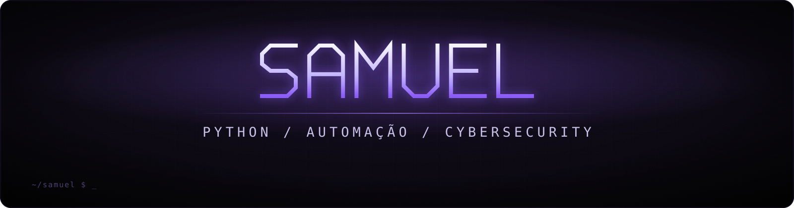
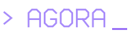
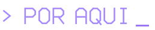
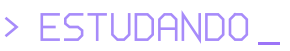

  

  <b>salve, eu sou o Samuel 👋</b> 
  curto automação, código e qualquer coisa que economize trabalho manual.

  
  
  
  
  
  
  

 

<table>
<tr>
<td width="50%" valign="top">

mexo mais com **Python**, automação, APIs e integrações. gosto de pegar processo repetitivo e deixar ele simples.

nas horas vagas, tô indo mais fundo em **cybersecurity**.

</td>
<td width="50%" valign="top">

› automação e integrações 
› APIs e backend 
› dados e documentos 
› Git / GitHub 
› cybersecurity

</td>
</tr>
</table>

 

<table>
<tr>
<td width="50%" valign="top">

#### Prumo
extrator de cálculos trabalhistas

lê cálculos e decisões, descobre de qual parte vem cada um e extrai os valores. só passa o que bate na validação, e tudo termina num relatório pra revisar.

`Python` `pytest` `Airtable API`

</td>
<td width="50%" valign="top">

#### Passe Limpo
publicação segura de projetos

skill pro Claude Code que limpa o projeto antes de publicar: tira dado sensível, lê imagens com OCR, commita com noreply e só sobe com `APROVADO`.

`Python` `Git` `GitHub CLI` `OCR`

</td>
</tr>
</table>

os dois estão privados por enquanto. nasceram de problema real do dia a dia, então aqui só entra versão com dado fictício ou sanitizado.

  

<table>
<tr>
<td width="33%" valign="top">

projetos pessoais, testes, automações e versões demonstrativas do que eu monto no dia a dia.

</td>
<td width="33%" valign="top">

Cybersecurity 
Git / GitHub 
Backend 
Boas práticas

</td>
<td width="33%" valign="top">

Python 
Automação 
Documentos 
Integrações 
IA aplicada a workflow

</td>
</tr>
</table>

 

  aos poucos eu vou deixando isso menos vazio.

