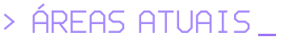

<p align="center">
  
</p>

<p align="center">
  <b>salve, eu sou o Samuel 👋</b><br>
  curto automação, código e qualquer coisa que economize trabalho manual.
</p>

<p align="center">
  
  
  
  
  
  
  
</p>

<br>

<table>
<tr>
<td width="50%" valign="top">


hoje eu mexo mais com **Python, automação, APIs e integrações**.

gosto de pegar processo repetitivo, planilha chata ou fluxo manual e deixar mais simples de usar.

no tempo livre, tô indo mais fundo em **cybersecurity**.

</td>
<td width="50%" valign="top">


```text
> automação e integrações
> APIs e backend
> dados e documentos
> Git / GitHub
> cybersecurity
```

</td>
</tr>
</table>

<br>


<table>
<tr>
<td width="50%" valign="top">

#### extrator de cálculos trabalhistas

lê planilhas de cálculo e decisões, descobre de qual parte é cada cálculo, extrai os valores e só libera o que passa numa validação contra um gabarito. nada é gravado sozinho: sai um relatório pra revisar.

`Python` `pytest` `Airtable API`

<sub>privado por enquanto · dados 100% fictícios</sub>

</td>
<td width="50%" valign="top">

#### publicar projeto

skill pro Claude Code que pega um projeto local, tira segredo e dado sensível, revisa imagem com OCR, faz o commit com e-mail noreply e só sobe pro GitHub depois de um `APROVADO`.

`Python` `Git` `GitHub CLI` `OCR` `AES-GCM`

<sub>privado por enquanto</sub>

</td>
</tr>
</table>

<sub>alguns projetos nasceram de problema real do dia a dia. quando isso acontece, aqui só entra versão com dado fictício ou sanitizado.</sub>

<br><br>

<table>
<tr>
<td width="33%" valign="top">


projetos pessoais, testes, automações e versões demonstrativas do que eu monto no dia a dia.

</td>
<td width="33%" valign="top">


cybersecurity<br>
Git / GitHub<br>
backend<br>
boas práticas

</td>
<td width="33%" valign="top">



automação<br>
APIs<br>
backend<br>
cybersecurity<br>
Git / GitHub

</td>
</tr>
</table>

<br>

<p align="center">
  <sub>esse perfil ainda tá evoluindo junto comigo.</sub>
</p>
